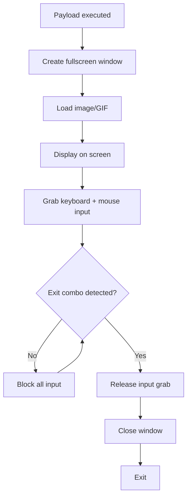
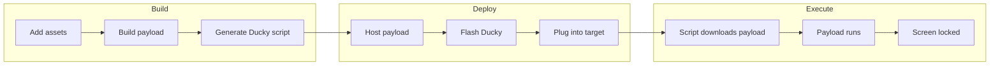

# screenjack

Fullscreen takeover tool for pranking your friends. Locks their screen, displays whatever image/GIF you want, and blocks input until they hit the secret exit combo.

## What it does

- Takes over the entire screen with your chosen image or GIF
- Blocks keyboard and mouse input (no alt-tabbing, no escape)
- Works on Linux (X11) and Windows
- Exit combo: hold `Ctrl+Shift+Escape` for 2 seconds

## Features

- **Cross-platform payloads** - Build for Linux and Windows from one machine
- **TUI orchestrator** - Manage assets, build payloads, generate deployment scripts
- **Rubber Ducky support** - Generate scripts for USB Rubber Ducky deployment
- **Docker builds** - No local toolchain needed, build in containers
- **GIF support** - Animated GIFs play on loop for maximum trolling
- **Embedded assets** - Image gets baked into the binary, single file deployment

## Requirements

### Build machine (Arch/Linux)

```bash
# Core tools
sudo pacman -S rust go just

# Windows cross-compile
sudo pacman -S mingw-w64-gcc
rustup target add x86_64-pc-windows-gnu

# Static Linux builds (optional)
sudo pacman -S musl
rustup target add x86_64-unknown-linux-musl
```

### Target machine

- **Linux**: X11 + libxcb (`sudo pacman -S libxcb` / `apt install libxcb1`)
- **Windows**: No dependencies, fully static binary

## Usage

### TUI (recommended)

```bash
just tui
```

The TUI lets you:
- Browse and preview assets (ASCII preview in terminal)
- Build payloads for Linux/Windows
- Generate Rubber Ducky scripts
- Configure deployment URLs
- View build logs

#### TUI Controls

| Key | Action |
|-----|--------|
| `tab` / `shift+tab` | Switch sections |
| `j` / `k` | Navigate up/down |
| `space` | Select/toggle |
| `b` | Build payloads |
| `g` | Generate Ducky script |
| `p` | Preview selected asset |
| `o` | Open assets folder |
| `l` | View build logs |
| `q` | Quit |

### Direct build

```bash
just build-linux      # -> dist/screenjack-linux
just build-windows    # -> dist/screenjack.exe
just build-all        # Both platforms
```

### Running the payload

```bash
# Linux
./screenjack-linux /path/to/rickroll.gif

# Windows
screenjack.exe C:\path\to\rickroll.gif
```

The payload takes over the screen immediately. Victim needs to hold `Ctrl+Shift+Escape` for 2 seconds to exit (good luck figuring that out mid-prank).

### Docker builds

No Rust toolchain? No problem. Build in containers:

```bash
just -f payload.just docker-alpine   # Static musl binary (works everywhere)
just -f payload.just docker-debian   # glibc binary
```

## Deployment

### Manual

1. Drop your GIFs/images in `assets/`
2. Build payloads via TUI or `just build-all`
3. Copy payload + asset to target machine
4. Run it

### Rubber Ducky

For walk-up-and-pwn scenarios:

1. Build your payload
2. Host it somewhere (local server, cloud, whatever)
3. Open TUI, configure the hosting URL
4. Hit `g` to generate Ducky scripts
5. Flash script to your Rubber Ducky
6. Plug into target, payload downloads and executes

Generated scripts live in `ducky/`:
- `payload_windows.txt` - PowerShell download + exec
- `payload_linux.txt` - curl + exec

## How it works



On Linux this uses X11/xcb for window management and input grabbing. On Windows it uses the Win32 API.

### Deployment flow



## Guide

Full writeup on how screenjackers work under the hood: [Malware Development Guide - Screenjackers](https://arachn3.gitbook.io/malware-development-guide/intermediate-malware/screenjackers)

## License

MIT
